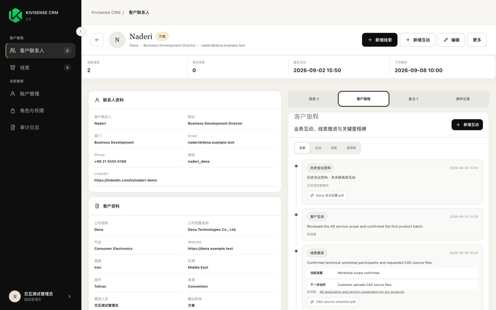
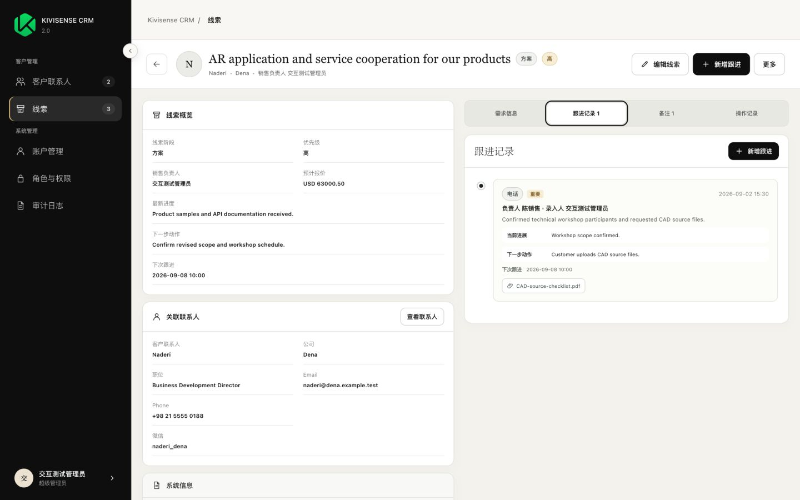
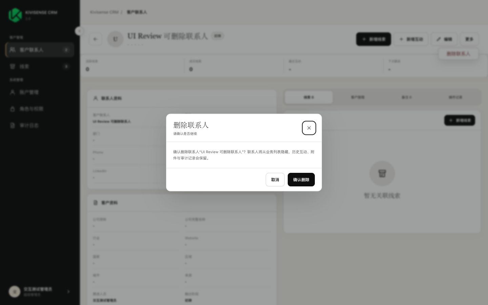
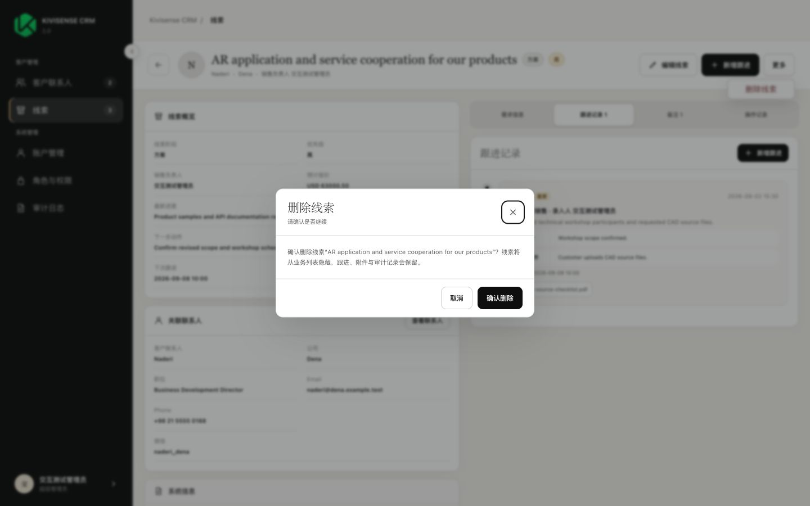

# Kivisense CRM 2.0 Journey & Form UX QA Evidence

## Test basis

- Application: Kivisense CRM 2.0 on `codex/kivisense-crm-v2-v1-ui-rebuild`.
- UI target: local fixture at `http://127.0.0.1:8766/`.
- Browser: Codex in-app Chromium, fixed width 1440 and height 900.
- Database: isolated MySQL on `127.0.0.1:13308`; all four Prisma migrations applied.
- Scope: Followup source of truth, Customer 360/Journey, sectioned forms, contextual attachments, Meeting Minutes migration, soft delete, Contact delete protection, import/export and RBAC regression.
- The automated-test-engineer workflow was used to keep deterministic gates, real MySQL checks, browser evidence and deployment status separate.

## Gate summary

| Gate | Result | Evidence |
|---|---|---|
| Frontend syntax and interaction contracts | PASS | 102 explicit `assert.*` statements plus syntax checks for all CRM modules and fixture |
| Backend unit suite | PASS | 12 / 12 |
| MySQL core integration | PASS | 12 / 12 |
| MySQL import/export integration | PASS | 6 / 6 |
| TypeScript lint | PASS | `tsc --noEmit` |
| Backend build | PASS | TypeScript build |
| Prisma schema | PASS | Schema valid |
| Prisma migration status | PASS | 4 migrations; database up to date |
| Field dictionary contract | PASS | 31 Contact + 44 Lead source headers |
| Browser UI checkpoints | PASS | 9 / 9 screenshots; 0 console errors and 0 warnings |
| Diff whitespace | PASS | `git diff --check` |

The evidence set contains at least 141 checkpoints: 102 frontend assertions, 12 unit cases, 18 database integration cases and 9 browser screenshot checkpoints. This count does not include TypeScript, build, Prisma, field-dictionary or diff gates.

## Business-critical checks

| ID | Priority | Check | Result |
|---|---:|---|---|
| JUX-001 | P0 | Interactive Lead create/patch cannot write snapshot fields | PASS |
| JUX-002 | P0 | Import keeps legacy snapshot compatibility without exposing it in forms | PASS |
| JUX-003 | P0 | Latest LeadFollowup updates latest progress, next action, last follow-up and next follow-up snapshots | PASS |
| JUX-004 | P0 | A backdated LeadFollowup does not roll snapshots backward | PASS |
| JUX-005 | P0 | ContactFollowup updates Contact next-follow-up only when it is the actual latest interaction | PASS |
| JUX-006 | P0 | Contact Journey combines Contact creation, interactions, Lead creation, Lead followups, status events, milestones and attachments | PASS |
| JUX-007 | P0 | Deleted Leads are excluded from active counts/list/detail/search/selectors/export | PASS |
| JUX-008 | P0 | Deleted Leads remain visible as historical Journey events | PASS |
| JUX-009 | P0 | Historical deleted-Lead attachments remain downloadable while the parent Contact is active | PASS |
| JUX-010 | P0 | Historical attachment download becomes unavailable after the parent Contact is deleted | PASS |
| JUX-011 | P0 | Contact soft delete is blocked while any active Lead remains | PASS |
| JUX-012 | P0 | Soft delete preserves Followups, attachments and audit records | PASS |
| JUX-013 | P0 | Delete audit actions use metadata-only `DELETE_CONTACT` and `DELETE_LEAD` payloads | PASS |
| JUX-014 | P0 | Contact edit omits Meeting Minutes upload and snapshot editing | PASS |
| JUX-015 | P0 | Legacy Contact Meeting Minutes appear in Journey as unlinked historical meeting material | PASS |
| JUX-016 | P0 | Contact/Lead Followup attachments accept images, video and documents | PASS |
| JUX-017 | P0 | Requirement/image/solution/quotation text and files render as contextual pairs | PASS |
| JUX-018 | P1 | Contact Customer 360 shows no more than four summary statistics | PASS |
| JUX-019 | P1 | Contact detail uses the V1 two-column hierarchy and four right-side tabs | PASS |
| JUX-020 | P1 | Contact edit uses Basic Data / CRM Info / Notes tabs | PASS |
| JUX-021 | P1 | Lead edit uses the exact five requested business tabs | PASS |
| JUX-022 | P1 | Lead related Contact remains immutable after creation | PASS |
| JUX-023 | P1 | Add Lead uses an accessible fuzzy-search combobox | PASS |
| JUX-024 | P1 | Lead create requires Contact, summary, stage, priority and sales owner | PASS |
| JUX-025 | P1 | Save & Continue Editing remains available for Lead creation | PASS |
| JUX-026 | P1 | Contact and Lead lists expose row-level delete controls | PASS |
| JUX-027 | P1 | Initial navigation counters load both active Contact and Lead totals | PASS |
| JUX-028 | P1 | Import/export columns include new Lead note/action fields | PASS |
| JUX-029 | P1 | Existing 31 Contact and 44 Lead source-header contracts remain unchanged | PASS |
| JUX-030 | P1 | Browser console remains clear after exercised flows | PASS |

## Browser evidence

The ordered file list, states and viewport data are in [capture_manifest.csv](qa-evidence-journey/capture_manifest.csv).

## Findings and retest

| ID | Severity | Finding | Resolution | Retest |
|---|---:|---|---|---|
| QA-JUX-001 | S3 | Initial navigation showed Lead count `0` until the Lead page had been visited | Load both active Contact and Lead totals during application entry | PASS; browser showed Contact `2`, Lead `3` before visiting the Lead list |
| QA-JUX-002 | S2 | Deleted-Lead Journey events retained attachment names but the active-record download guard returned 404 | Added read-only historical download authorization while the parent Contact remains active; create/remove still require active records | PASS in real MySQL integration; becomes 404 after Contact deletion |

## Open issues

No open local functional issue was found in the exercised scope. Live UAT and deployment verification are intentionally `NOT_RUN` pending UI review.
