# Kivisense CRM 2.0 Field Alignment QA Evidence

## Environment and scope

- Local UI fixture: `http://127.0.0.1:8767/`
- Browser: Codex in-app Chromium
- Viewports: 1440×900, 1280×800, 1024×768
- Database: isolated MySQL 8.4 container on `127.0.0.1:13307`
- Source workbook: `弥知科技Kivisense项目看板 - 表头.xlsx`
- Tested scope: field dictionary, migration, Contact/Lead CRUD, Contact/Lead followups, Contact 1:N Lead, participants, attachments, import/export, permissions, responsive layout, and console health.

## Case results

| Case | Module | Priority | Result | Evidence / assertion |
|---|---|---:|---|---|
| FA-001 | Field dictionary | P0 | PASS | 31 Contact and 44 Lead headers exact and ordered |
| FA-002 | Database migration | P0 | PASS | All three migrations applied on a clean MySQL 8.4 database |
| FA-003 | Upgrade preservation | P0 | PASS | Previous Contact, Lead, technologyType, and LeadAttachment metadata survived migration |
| FA-004 | Contact CRUD/detail | P0 | PASS | API integration plus screenshots 01–04 |
| FA-005 | Lead CRUD/detail | P0 | PASS | API integration plus screenshots 05–07 |
| FA-006 | Contact 1:N Lead | P0 | PASS | Two leads linked to one Contact; Contact fields read live in Lead detail |
| FA-007 | Lead participants | P0 | PASS | Multiple active users saved; duplicate IDs deduplicated; disabled user rejected |
| FA-008 | wonAt | P0 | PASS | First transition to WON sets once; later edits preserve timestamp |
| FA-009 | Attachment upload | P0 | PASS | PDF, DOCX, JPG, PNG, MP4, TXT accepted in valid fields |
| FA-010 | Attachment rejection | P0 | PASS | HTML extension, MIME spoof, oversize, wrong entity ID, and wrong field rejected |
| FA-011 | Attachment lifecycle | P0 | PASS | View/download/delete, storage cleanup, and audit actions verified |
| FA-012 | Contact Meeting Minutes | P0 | PASS | Real chooser flow, pending state, save, and detail persistence verified |
| FA-013 | Searchable Contact selector | P0 | PASS | `Nad` returned one dropdown option and did not render the old full list |
| FA-014 | Import/export | P0 | PASS | Templates, preflight, execute, attachment URL warning, exports, and UI dialogs verified |
| FA-015 | RBAC | P0 | PASS | VIEWER read-only; attachment view/download visible; write/import/export/delete hidden |
| FA-016 | Responsive UI | P1 | PASS | No document-level horizontal overflow at 1440, 1280, or 1024; tables scroll inside their cards |
| FA-017 | Browser console | P1 | PASS | 0 error/warning entries after exercised flows |

## Ordered browser evidence

### 1. Contact list at 1440

Verifies the three independent white metric cards, batch import/export, filters, row delete affordance, and V1 density.

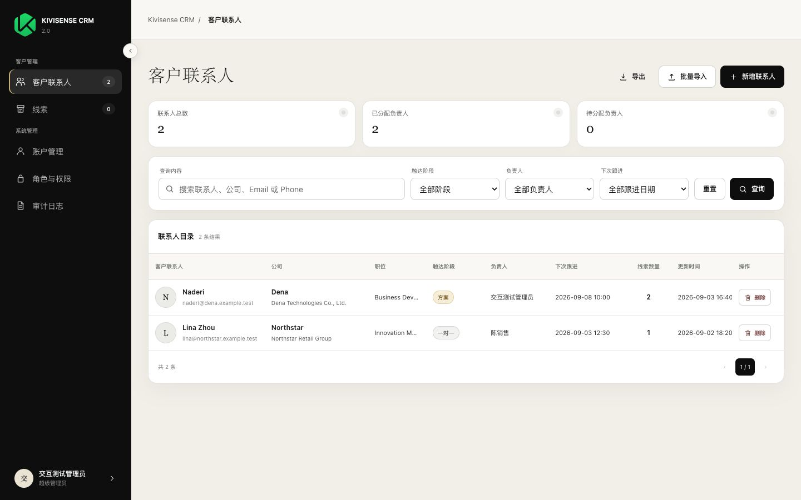

### 2. Contact detail at 1440

Verifies Contact profile, Customer profile, Meeting Minutes, weak system information, Contact 1:N Lead, and the existing tab layout.

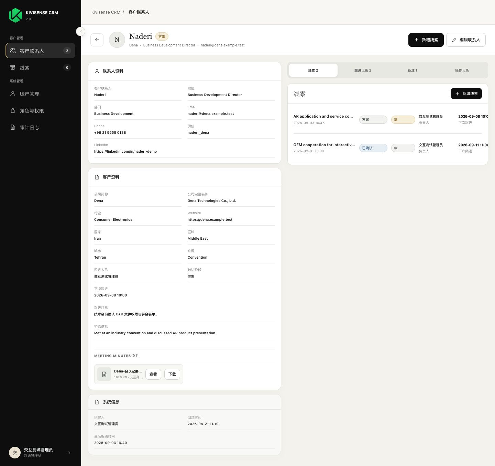

### 3. Contact edit field coverage

Verifies the fixed Contact fields are grouped rather than rendered as an Excel-like table.

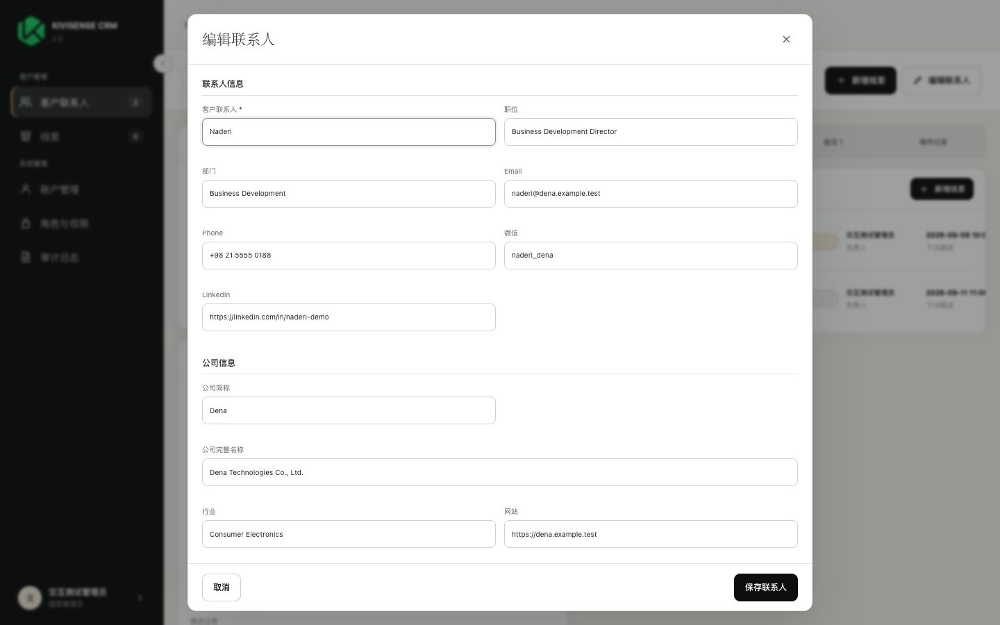

### 4. Contact Meeting Minutes editor

Verifies the real file chooser surface, existing-file view/remove actions, 20-file limit copy, and 50 MB limit copy.

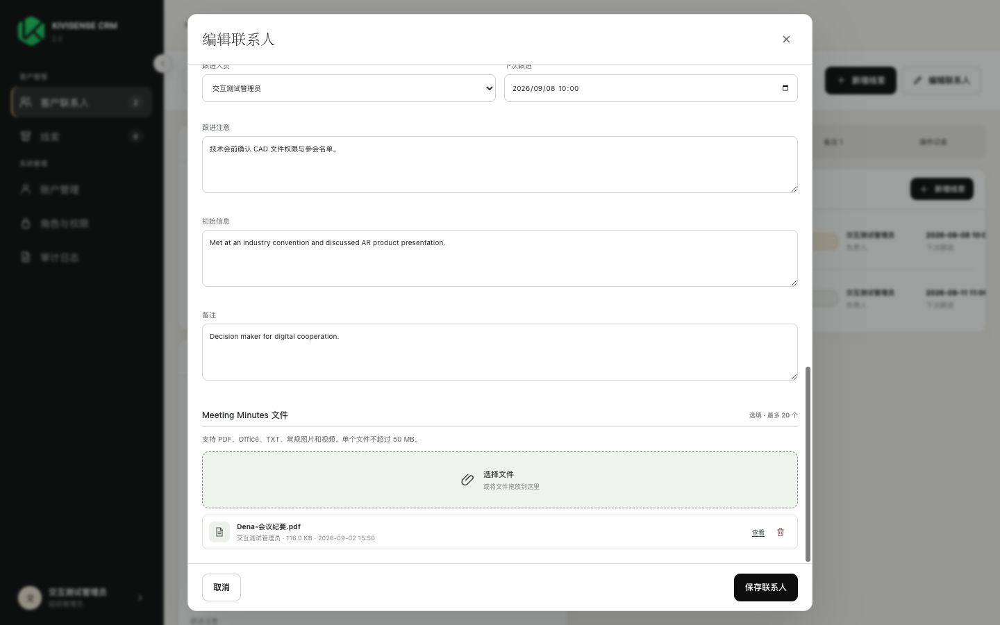

### 5. Lead list at 1440

Verifies four white metric cards, import/export, filters, delete action, and contained table scrolling.

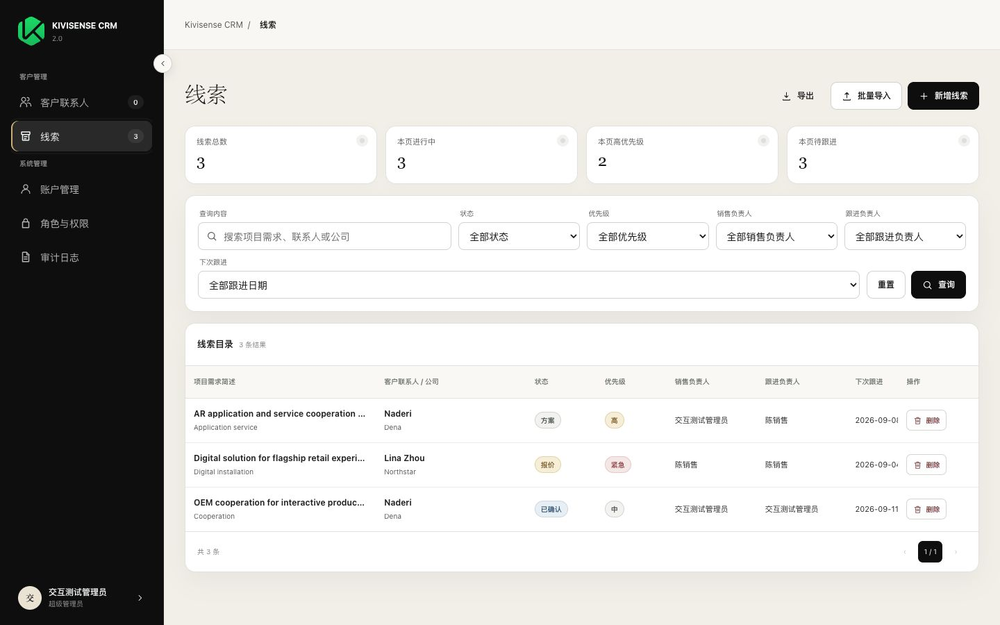

### 6. Lead detail and field-specific attachments

Verifies Overview, Related Contact, System Information, Requirement content, Project classification, Solution/commercial content, four attachment fields, metadata, thumbnail, view, and download.

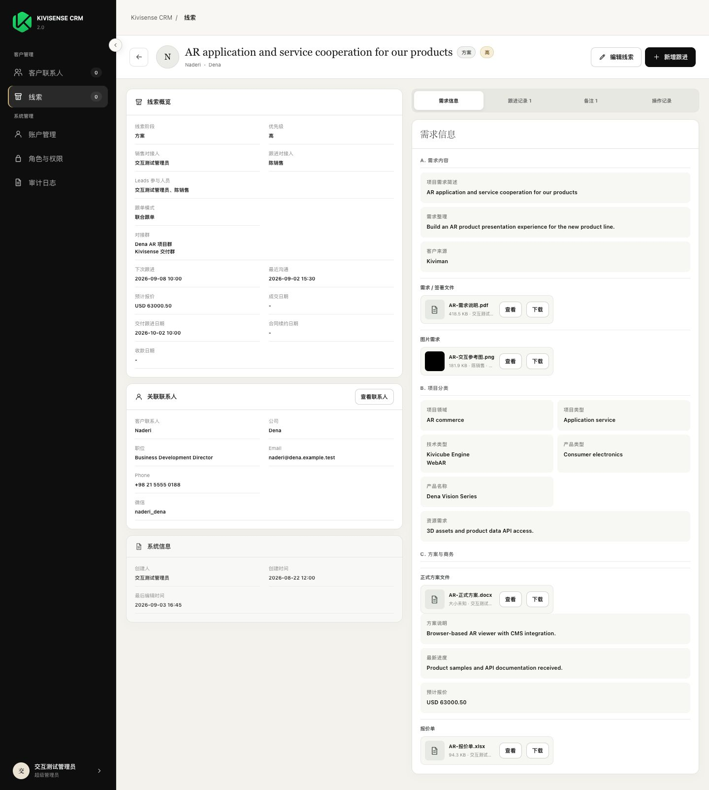

### 7. Fuzzy Contact search in Add Lead

Verifies the ARIA combobox, search input, one filtered dropdown option, and compact result styling.

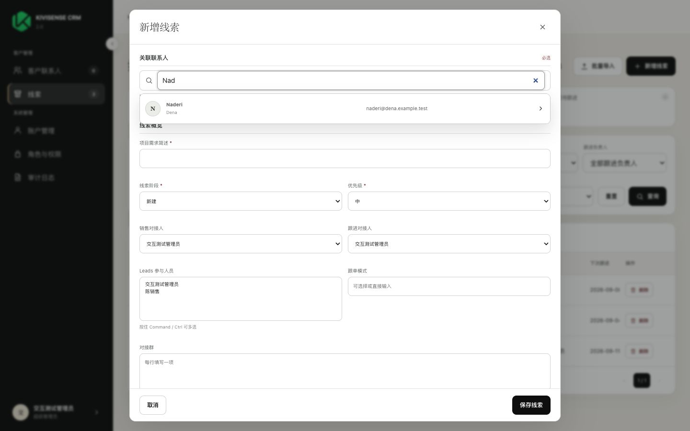

### 8. Lead batch import

Verifies XLSX upload, template download, three-step import flow, row limit, and history entry point.

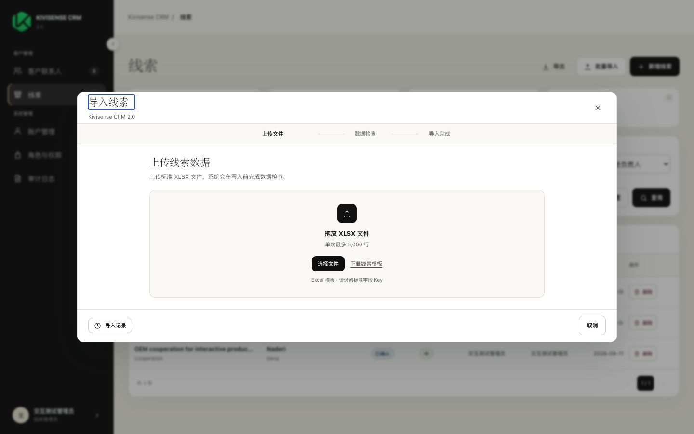

### 9. Lead list at 1280

Verifies wrapped filters and contained horizontal table scrolling without page overflow.

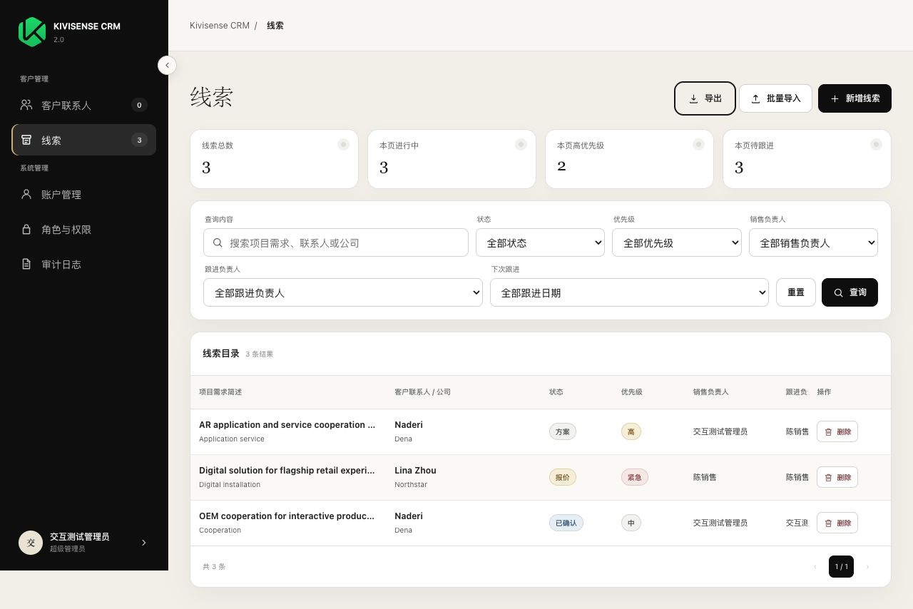

### 10. Lead list at 1024

Verifies compact columns and preserved operation column without page overflow.

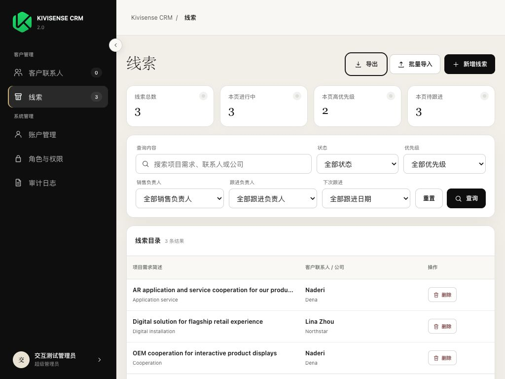

### 11. Contact list at 1024

Verifies the three metric cards, wrapped filters, compact table, and visible delete action.

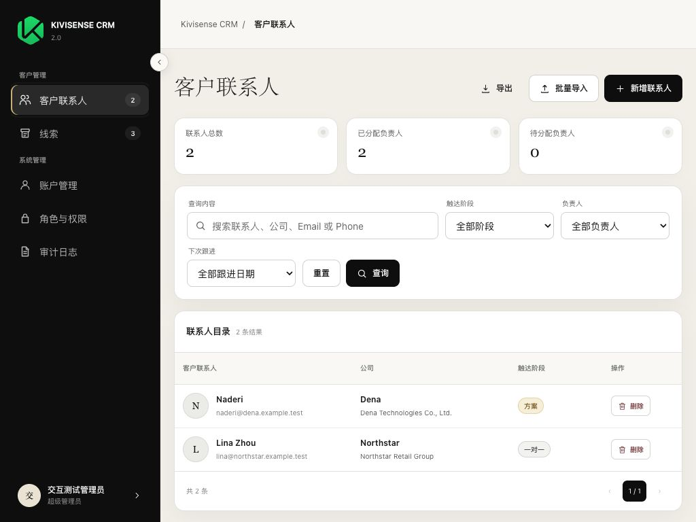

## Data and URL mapping

The exercised CRM chain is:

`Contact Naderi` → `Lead AR application and service cooperation for our products` → `fieldKey-specific CrmAttachment` → authenticated `/api/v1/crm/{contacts|leads}/{entityId}/attachments/{attachmentId}/download` → detail view and XLSX export.

Model/Size/Channel/SKU/AI-generation mapping is not applicable to this CRM field-alignment scope.

## Coverage gaps

- UAT login and post-deploy smoke are recorded separately in the completion report because they require the live deployment.
- Deferred Cost, Project Assessment, Contract, and Sales Content target modules remain intentionally out of scope.
- Five ambiguous legacy milestone headers remain `NEED_CONFIRMATION`; no speculative fields were created.

